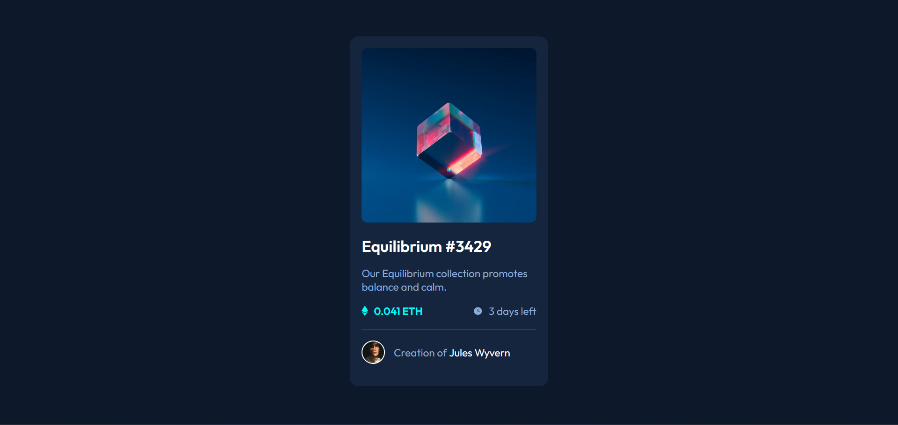

### The challenge

Users should be able to:

- View the optimal layout depending on their device's screen size
- See hover states for interactive elements

### Screenshot

### Links

- Solution URL: [Github](https://github.com/jmmaglonzo/Frontend-Mentor-NFT-preview-Card)
- Live Site URL: [Netlify](https://lonzo-nft-preview-card.netlify.app/)

### Built with

- Semantic HTML5 markup
- CSS custom properties
- Flexbox
- CSS Grid

### What I learned

-add some hover effects although it is not completed

### Continued development

- I'm stil learning the position relative and absolute

## Author

- Frontend Mentor - [@jmmaglonzo](https://www.frontendmentor.io/profile/jmmaglonzo)
